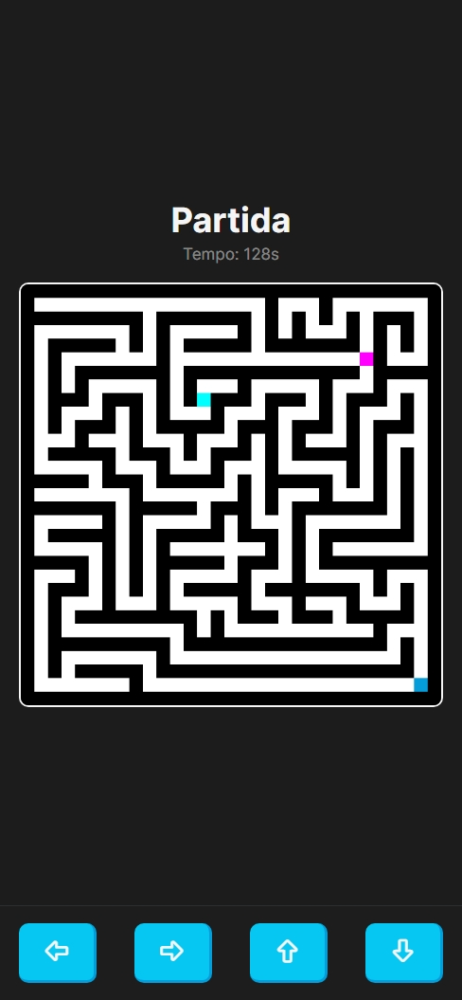

# Labirinto-Jogo-Multijogador

## Introdução

Bem-vindo ao Jogo de Labirinto Multiplayer, um desafio de labirinto implementado com JavaScript, HTML, CSS, nodeJs, express e socket.io.

## Instruções de Jogo 🕹️

1. Abra o [Jogo](https://carloseduts.github.io/Labirinto-Jogo-Multijogador/) em seu navegador da web.
2. Use as teclas de seta do teclado para mover o personagem através do labirinto.
3. O objetivo é encontrar a saída do labirinto antes dos outros jogadores!

## Funcionalidades Principais ⭐

- Controle intuitivo utilizando as teclas de seta.
- Temporizador integrado para acompanhar o tempo gasto no jogo.
- Interface gráfica amigável e acessível.
- Vença os outros Jogadores.

## Contribuições 🤝

Contribuições são bem-vindas! Sinta-se à vontade para abrir uma issue ou enviar um pull request.

## Autor 👨‍💻

O Jogo de Labirinto foi desenvolvido por [Carlos Eduardo](https://github.com/CarlosEduts).

## Créditos dos Ícones 🎨

Os ícones utilizados neste projeto foram cedidos pela biblioteca Tabler Icons. Para mais informações sobre a biblioteca e para explorar sua vasta coleção de ícones, visite [https://tabler.io/icons](https://tabler.io/icons).

## Licença 📝

Este projeto está licenciado sob a Licença MIT. Consulte o arquivo `LICENSE` para obter mais detalhes.

## Links 🌐

Acesse o Jogo [Aqui!](https://carloseduts.github.io/Labirinto-Jogo-Multijogador/).
 
Jogo Solo: [Labirinto-Jogo](https://carloseduts.github.io/Labirinto-Jogo-/)
 
Algoritmo responsável pela geração das imagens dos labirintos: [https://projeto-de-algoritmos.github.io/Grafos2_MazeGenerator/](https://projeto-de-algoritmos.github.io/Grafos2_MazeGenerator/)

## Imagens do Projeto 🖼️

